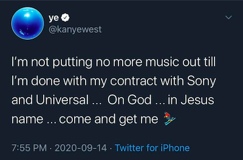

# Response to Kanye West's idea of a "Y Combinator for the music industry"

Two nights ago, Kanye took to Twitter to post this now-deleted tweet, which marked the beginning of a days-long onslaught of tweets—which as of this writing are still coming—airing out his frustrations about the way major label record deal are structured.

Yesterday one of these tweets caught my eye:

<blockquote class="twitter-tweet">
When I spoke to Katie Jacobs who is on the board of Vivendi we decided to create a “Y combinator” for the music industry so artist have the power and transparency to to be in control of our future ... no more shady contracts ... no more life long deals
&mdash; ye (@kanyewest) <a href="https://twitter.com/kanyewest/status/1305977929180966913?ref_src=twsrc%5Etfw">September 15, 2020</a></blockquote> 

Knowing how impulsive of a personality Kanye is, I figured it was pretty unlikely a YC-like artist accelerator program was *officially* in the works with Vivendi (which owns Universal Music Group). Perhaps Kanye voiced the idea during a lengthy tirade on a phone call with some Vivendi/UMG executive who reached out hoping to mend the fraught relationship between West and the label and gave deference to the idea just to appease him. A "yeah that sounds like a great a idea Kanye, we'll definitely look into that!" Still, the idea sounded interesting and I wanted to sketch out some thoughts on what a "Y Combinator for the music industry" might even look like. Here are those thoughts:

If kanye's intentions are to create a better, less exploitative industry model for artists, then this doesn't seem like the answer. [Y Combinator](https://en.wikipedia.org/wiki/Y_Combinator) is a startup accelerator that offers early-stage tech companies mentoring, networking, a considerable amount of industry prestige, and most importantly, seed funding in exchange for equity. Some of their biggest and most successful alumni include Dropbox, Airbnb, Reddit, Instacart, and DoorDash. The closest existing thing to that in the music industry is....a record label. But majors no longer invest in artist development like they used to, preferring now to sign acts that are already developed. To fill that gap a number of "artist incubators" have cropped up in the music industry over the last few years, offering artist development services & career guidance for (typically) a 50% cut of earnings. But I'm pretty skeptical of them because there's nothing they offer that artist management firms don't already do better, and for a much smaller cut of artists' earnings (typically 15-30%). Plus, the duration of the working relationship between artist managers and their clients far exceeds that of a couple months-long "incubator" program, netting better results for the artists in the long run. In the business world, the difference between incubators & accelerators is that only the latter offers seed money. So a "Y Combinator for artists" (i.e., an artist accelerator) created in partnership with Vivendi—which, again, owns Universal Music Group—will likely perform most of the same functions a record label already does, only with a larger investment in artist development. And that really doesn't sound all that revolutionary.

Maybe instead the idea is just to launch a competitor to [UnitedMasters](https://unitedmasters.com/) or Kobalt Music Group's [AWAL](https://www.awal.com/): a digital distribution service for independent artists that also provides free "career dev" tools like streaming and social analytics, detailed earning reports, DSP smart link pages for music releases, and perhaps even seminars like Spotify for Artists has. And then for select talent, an option to sign a record deal and secure other artist services like sync licensing and brand deal opportunities and whatnot. The only thing is, Universal Music Group already has a music distribution service that does all that: [Spinnup](https://spinnup.com/uc/). So who knows! Hard to say exactly what Kanye has in mind for this "YC for the music industry" idea, and given that it *is* Kanye, the whole thing might not even come to fruition. I'm looking forward to seeing how (or if) any of this plays out.